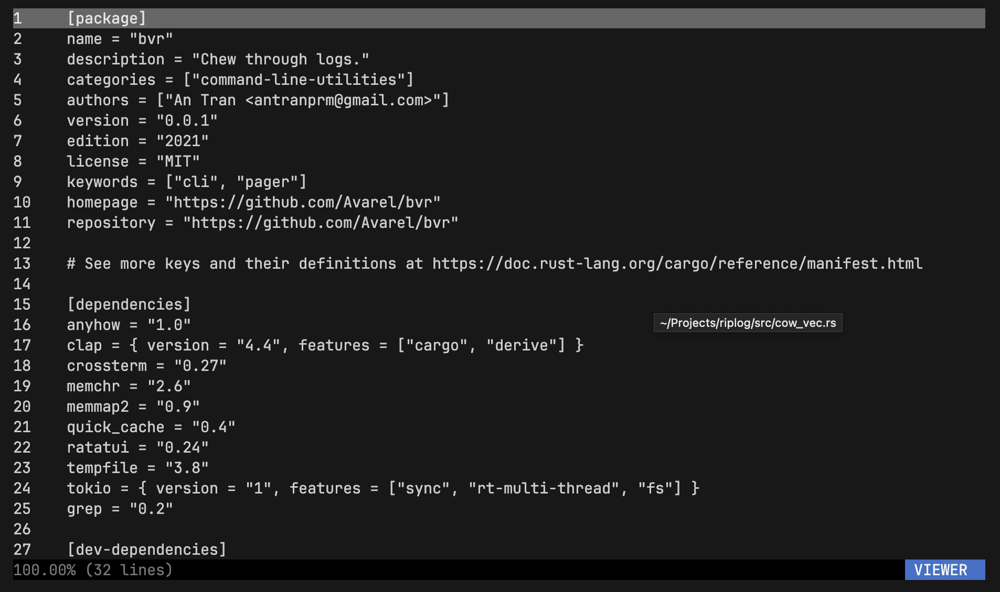

# bvr

Powerful pager written in rust, purpose-built for chewing through logs.

BVR (pronounced "beaver") is still under heavy development.

## Motivation

I needed a pager that could handle large log files and be fast and responsive.
I especially hated grepping a file, piping it to less, exiting and then grepping
with a different regex. I wanted to compare log files side by side. I also needed
a plethora of other features that I couldn't find in any other pager.

### Goals
* Fast and responsive
* Intuitive and easy to use
  * Intuitive keybindings
  * Mouse support
* Targeted use: scrolling through log files
  * Multiplexing
* Built from the ground up to be modular
* Simple and easy to understand codebase

### Non-Goals
* Syntax highlighting
* Editing files

## Features

### In-Progress or Planned
| Feature            | Description                                                 | Progress       |
| ------------------ | ----------------------------------------------------------- | -------------- |
| Mouse Support      | Use mouse to interact with the TUI.                         | In Development |
| Filter Jumping     | Jump to the next or previous line that matches a filter.    | Planned        |
| Custom Keybindings | Customize the keybindings of the program.                   | Planned        |
| Word-Wrapping      | Wrap long lines.                                            | Planned        |
| Export Output      | Export selected data to a file or pipe it to a new command. | Planned        |

### Basic Support
| Feature              | Description                                                 | Progress |
| -------------------- | ----------------------------------------------------------- | -------- |
| Piping Files         | View piped outputs of other programs, ie. `cat file \| bvr` | Basic    |
| Status Bar           | View current state of the pager.                            | Basic    |
| Horizontal Scrolling | Pan the view horizontally.                                  | Basic    |
| Commands             | Use modal commands to interact with the pager.              | Basic    |
| Regex Filters        | Select and disable additive search filters.                 | Done     |
| Multiplexing         | View multiple files through tabs or windows.                | Done     |
| Follow Output        | Constantly scroll down as new data is loaded.               | Done     |

## Built-in Keybindings
* Custom keybindings will be added in the future.

### Viewer Mode
This is the default mode. You can scroll through files.

| Keybinding                      | Description                                          |
| ------------------------------- | ---------------------------------------------------- |
| `Up` and `Down`                 | Pan the view.                                        |
| `Home`/`g` and `End`            | Pan the view to the start or end of the file.        |
| `G`                             | Pan the view to the end of the file (follow output). |
| `PageUp` and `PageDown`/`Space` | Pan the view by a page.                              |
| `Shift` + `Up` and `Down`       | Pan the view by a half-page.                         |

### Command Mode
In this mode, you can enter commands to interact with the pager.

| Command         | Description                                          |
| --------------- | ---------------------------------------------------- |
| `:q`            | Quit.                                                |
| `:mux`          | Toggle the multiplexer mode between windows or tabs. |
| `:open <file>`  | Open a file in a new tab/view.                       |
| `:close`        | Close the current tab/view.                          |
| `:find <regex>` | Create a new filter searching for the regex.         |
| `:findl <lit>`  | Create a new filter searching for the literal.       |
| `:<number>`     | Go to the specific line number.                      |

### Selection Mode
In this mode, you can select lines to bookmark.

| Keybinding          | Description                      |
| ------------------- | -------------------------------- |
| `Up` and `Down`     | Move the select cursor.          |
| `Space` and `Enter` | Toggle bookmark at current line. |

### Filter Mode
In this mode, you can toggle filters from bookmarks or searches to omit or include certain lines in the viewer.

| Keybinding          | Description                              |
| ------------------- | ---------------------------------------- |
| `Esc` and `Tab`     | Exit selection mode (enter viewer mode). |
| `:`                 | Enter command mode.                      |
| `i`                 | Enter selection mode.                    |
| `Up` and `Down`     | Change which filter is selected.         |
| `Space` and `Enter` | Toggle selected filter.                  |

### Mode-Independent
| Keybinding      | Description                               |
| --------------- | ----------------------------------------- |
| `Esc`           | Exit selection mode (enter viewer mode).  |
| `:`             | Enter command mode.                       |
| `i`             | Enter selection mode.                     |
| `Tab`           | Enter filter mode.                        |
| `` ` `` and `~` | Switch selected view.                     |
| `1` .. `9`      | Switch selected view to the `n`th buffer. |
