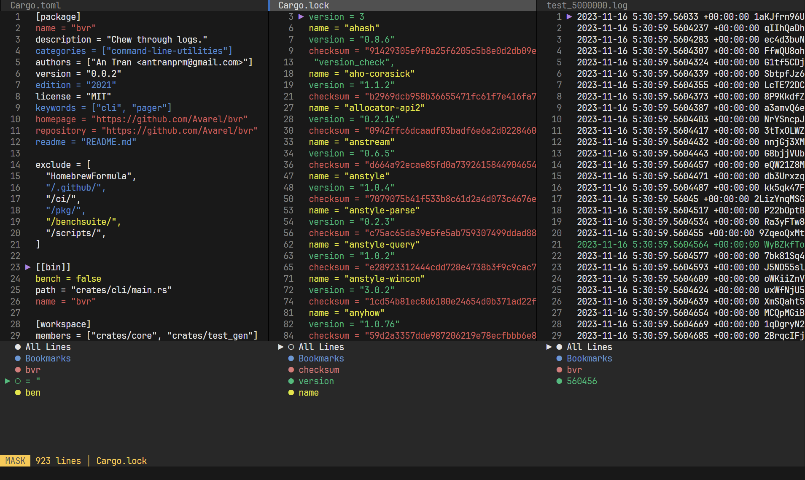

# bvr

Powerful pager written in rust, purpose-built for chewing through logs.

BVR (pronounced "beaver") is still under heavy development.

## Features
* Multiplexing (tabs and vertical splits)
* Fast yet simple design
* Intuitive
* Scroll support

## Planned Features
* Mouse support
* Search (powered by ripgrep)
* Search layers
* Piping support
* More commands
* Better status bar